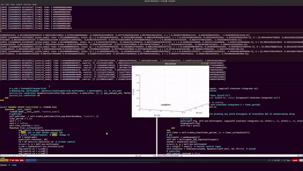

# FSimROS
A package of [FlightSims.jl](https://github.com/JinraeKim/FlightSims.jl) family for ROS2.

Note that `./src/fsim_interfaces` is a ROS2 package for providing interfaces of FlightSims.jl family.

## Examples
### Minimal publisher-subscriber example
See `./test/pubsub`.

### Processor in the loop simulation (PILS)
See `./test/PILS`.
- On a terminal, run as `julia test/PILS/simulator.jl` and wait until a figure is shown.
- On a new terminal, run as `julia test/PILS/controller.jl`.
- On another new terminal, run as `julia test/PILS/gcs.jl` (which is "timer").
See the result of circular trajectory tracking (video speed adjusted):

## To-do
- [ ] sync issues (maybe?) for divergence of controller (which requires integration)
    - Perhaps, we need a central node for topic `time` and each simulation and controller receives the `time` to propagate own dynamical system and adaptive control system.

## Notes
- ROS2 should be installed.
- Put `./src/fsim_interfaces` in `dev_ws/src` (ROS2 convention; don't be confused with `./src`) where your ROS2 workspace is, namely, `dev_ws`.
- Tested with only few test environments, e.g., Ubuntu 20.04, ROS2 foxy, docker.
- You must properly source the appropriate workspace in every terminal.
